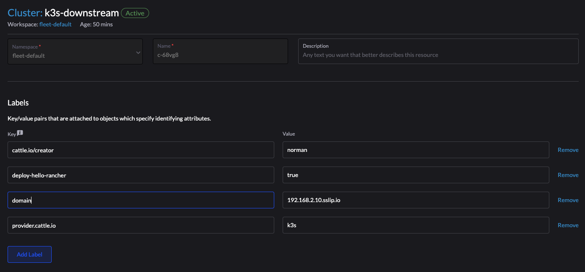

# Fleet demo with Hello Rancher

For fleet-local, execute:
```
kubectl apply -f https://raw.githubusercontent.com/Evantage-WS/fleet-deployments/main/_fleet-definitions/fleet-local/gitrepo.yaml
kubectl apply -f https://raw.githubusercontent.com/Evantage-WS/fleet-deployments/main/_fleet-definitions/fleet-local/clustergroup.yaml
```
For fleet-default, execute:
```
kubectl apply -f https://raw.githubusercontent.com/Evantage-WS/fleet-deployments/main/_fleet-definitions/fleet-default/gitrepo.yaml
kubectl apply -f https://raw.githubusercontent.com/Evantage-WS/fleet-deployments/main/_fleet-definitions/fleet-default/clustergroup.yaml
```

### Add the domain label to the cluster object in 'Continuous Delivery' -> Clusters -> 'clustername', this is used by the ingress

```
IP_ADDRESS=$(kubectl -n hello-rancher get ingress hello-rancher -o jsonpath="{.status.loadBalancer.ingress[].ip}")
echo "add the label 'domain' => '${IP_ADDRESS}.sslip.io' to the cluster"
```


